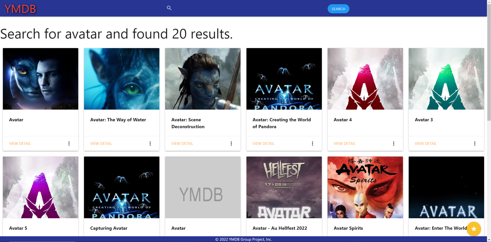

# Your-Movie-Database:

- [Description](#description)
- [Deployment](#deployment)
- [Visualization and Usage](#visualization-and-usage)
  - [Main Page](#main-page)
  - [Search and Results](#search-and-results)
  - [Favourite](#favourite)
- [Contributors and Github Profile Links](#contributors-and-github-profile-links)
- [Libraries and APIs](#libraries-and-apis)
- [Contribution](#contribution)
- [License](#license)

## Description

Your Movie Database is a movie application that will present the user with related links on Youtube based on their searches. The user will search by movie name and then they will be presented with results based on that movie title. The user can also make their selections a favorite, allowing them to have that info saved to their dashboard, so they can always come back and check it out.

## Deployment

[Deployed Application](https://hmhtom.github.io/Your-Movie-Databse)

[Github Repository](https://github.com/hmhtom/Your-Movie-Databse)

[Presentation](https://docs.google.com/presentation/d/1pvv8hrDIGPZjo07nFUxO7vithkSkSIW29vEby_9Xn1w/edit?usp=sharing)

## Visualization and Usage

### Main Page

> This is the main page when launched
>
> 

> Scroll down to see the trending movies for the week.
>
> 

### Search and Results

> Search bar is located in navigation bar on all pages
>
> 
>
> Type in the movie title you want to search for and click search and you will be redirect to the search result page
>
> 

> On each result cards you can click the more icon on bottom right to read the overview about the movie
>
> 
> 

> You can also click on the `View Detail` on the bottom left to go to the movie info page
>
> 

> On the movie info page you will find the detail information about the movie which will include: title, genre, release date, overview, production companies IMDB link, and related Youtube videos for the movie.
>
> 

### Favourite

> On main page and search result page you will find a favourite icon on the bottom right
>
> 
>
> A simple drag and drop will add the movie to favourite
>
> 
>
> Clicking the favourite button will take you to the favourite page, where you can browse all your favourite movies and also delete them with the `x` on the bottom right of each movie card
>
> 
>
> You can also add and remove from favourite on the movie info page with the favourite button on the bottom right corner
>
> 

## Contributors and Github Profile Links

[Abdirahman Daqane](https://github.com/AbdiDaqane)

[Alex He](https://github.com/hmhtom)

[Thiviya Sivasithamparam](https://github.com/thivsiv28)

## Libraries and APIs

- [Materialize CSS Framework](https://materializecss.com/)
- [jQuery](https://jquery.com/)
- [jQueryUI](https://jqueryui.com/)
- [TMDB API](https://developers.themoviedb.org/3)
- [Youtube API](https://developers.google.com/youtube)

## Contribution

Pull requests are welcome. For major changes, please open an issue first to discuss what you would like to change.

## License

MIT License 

Copyright (c) 2022 Alex He

Permission is hereby granted, free of charge, to any person obtaining a copy
of this software and associated documentation files (the "Software"), to deal
in the Software without restriction, including without limitation the rights
to use, copy, modify, merge, publish, distribute, sublicense, and/or sell
copies of the Software, and to permit persons to whom the Software is
furnished to do so, subject to the following conditions:

The above copyright notice and this permission notice shall be included in all
copies or substantial portions of the Software.

THE SOFTWARE IS PROVIDED "AS IS", WITHOUT WARRANTY OF ANY KIND, EXPRESS OR
IMPLIED, INCLUDING BUT NOT LIMITED TO THE WARRANTIES OF MERCHANTABILITY,
FITNESS FOR A PARTICULAR PURPOSE AND NONINFRINGEMENT. IN NO EVENT SHALL THE
AUTHORS OR COPYRIGHT HOLDERS BE LIABLE FOR ANY CLAIM, DAMAGES OR OTHER
LIABILITY, WHETHER IN AN ACTION OF CONTRACT, TORT OR OTHERWISE, ARISING FROM,
OUT OF OR IN CONNECTION WITH THE SOFTWARE OR THE USE OR OTHER DEALINGS IN THE
SOFTWARE.
